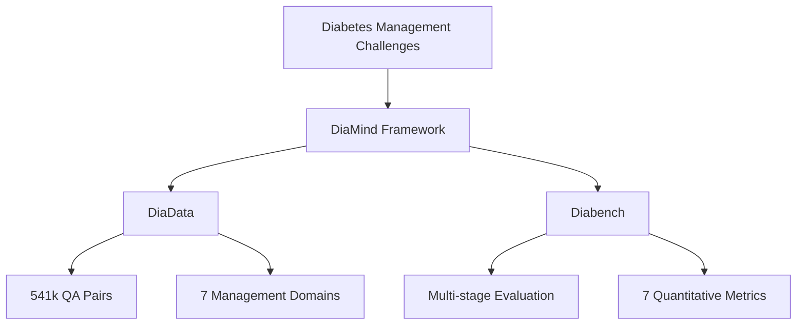
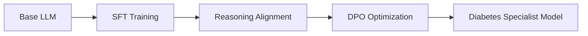

# DiaMind: A Comprehensive Medical Dataset and Benchmark for Diabetes Management

**DiaMind** is the first integrated diabetes management framework combining:
-  🧠 **DiaData**: Comprehensive dataset for diabetes understanding
-  📊 **Diabench**: Multi-dimensional evaluation benchmark
-   **Multi-stage training framework**: Enhanced reasoning for clinical care

##  🔍 Overview
Diabetes affects **10.2%** of global adults (IDF 2030 projection) with inadequate management increasing complication risks. DiaMind bridges critical gaps in diabetes care AI by providing:
- ✅ Clinically validated QA pairs
-  🧬 Interdisciplinary knowledge integration
-  📈 Enhanced reasoning capabilities
-   Real-world clinical applicability

##✨ Key Contributions
### 1. DiaData: Integrated Diabetes Dataset
| Component | Description | Size |
|-----------|-------------|------|
| **DiaRAG** | Retrieval-augmented resources | 289 guidelines/articles |
| **DiaQA** | Clinically validated QA pairs | 541,606 pairs |
| **Answer Types** | - Direct responses - CoT reasoning traces - Reward-optimized outputs | 542k / 53k / 7.8k |

### 2. Diabench: Evaluation Benchmark
- **7 quantitative metrics** for daily management
- **Multi-stage assessment**:
1. Supervised Fine-Tuning (SFT)
2. Reasoning Alignment
3. RLHF Optimization
- **Clinical evaluation dimensions**:
- Pathology • Diagnostics • Treatment • Complications • Patient Care

### 3. Multi-stage Training Framework

##📊 Key Results
### Data Quality Improvement
| Answer Type | Score Improvement |
|-------------|-------------------|
| Online Doctor Answers | Baseline |
| DeepSeek-V3 (Zero-shot) | +6-22% |
| **DiaMind (Ours)** | **+28-43%** |

### Model Performance (Qwen-7B)
| Training Stage | ROUGE-L | BERT Score |
|----------------|----------|------------|
| No SFT | 0.353 | 0.362 |
| Medical SFT Only | 0.352 | 0.360 |
| **Full DiaMind Training** | **0.393** | **0.380** |
