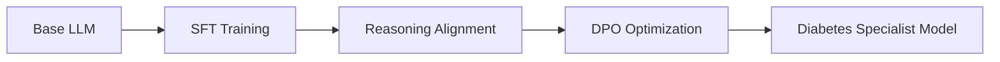

# DiaMind: A Comprehensive Medical Dataset and Benchmark for Diabetes Management

**DiaMind** is the first integrated diabetes management framework combining:
-  🧠 **DiaData**: Comprehensive dataset for diabetes understanding
-  📊 **Diabench**: Multi-dimensional evaluation benchmark
-   **Multi-stage training framework**: Enhanced reasoning for clinical care

##  🔍 Overview
Diabetes affects **10.2%** of global adults (IDF 2030 projection) with inadequate management increasing complication risks. DiaMind bridges critical gaps in diabetes care AI by providing:
- ✅ Clinically validated QA pairs
-  🧬 Interdisciplinary knowledge integration
-  📈 Enhanced reasoning capabilities
-   Real-world clinical applicability


## 🛠️ RAG Technology Enhancement

### RAG Retrieval System Construction Process

#### 1. Knowledge Base Architecture Design
DiaMind has constructed two Ollama-based RAG vectorized knowledge bases:

**General Medical Knowledge Base** (6 specialized fields):

```python
general_medical_kb = {
    "internal_medicine": "Internal medicine textbook resources",
    "obstetrics_gynecology": "Obstetrics and gynecology materials",
    "andrology": "Andrology literature",
    "surgery": "Surgery textbooks",
    "pediatrics": "Pediatrics knowledge",
    "endocrinology": "Endocrinology specialized content"
}
```

**Diabetes-Specific Knowledge Base** (7 classification dimensions):
```python
diabetes_specific_kb = {
    "complications_management": "73 monographs on complications management",
    "disease_foundation": "46 foundational disease guidelines",
    "clinical_evaluation": "31 clinical evaluation plans",
    "lifestyle_intervention": "31 lifestyle intervention strategies",
    "mental_health": "38 mental health support resources",
    "pharmaceutical_technology": "59 references on pharmaceutical and technological treatments"
}
```

#### 2. Document Processing & Vectorization Pipeline
```
Original Medical Documents → Professional Classification → Text Chunking Processing → Vectorization Encoding → Index Construction
```

#### 3. Core Retrieval System Technologies
- **Hybrid Retrieval Strategy**: Dense vector retrieval + Keyword retrieval fusion
- **Top-3 Evidence Recall**: Returns the 3 most relevant medical evidence snippets per query
- **Timeliness Validation**: Prioritizes retrieval of the latest clinical guidelines and research findings

### RAG System Usage Process

#### 1. Query Processing & Evidence Retrieval (Pseudocode)
```python
def rag_retrieval(user_query, patient_context=None):
    # Query Understanding & Expansion
    medical_terms = extract_medical_entities(user_query)
    expanded_queries = query_expansion(medical_terms)
    
    # Multi-Knowledge Base Parallel Retrieval
    general_results = vector_search(expanded_queries, "general_medical")
    diabetes_results = vector_search(expanded_queries, "diabetes_specific")
    
    # Evidence Fusion & Re-Ranking
    ranked_evidence = clinical_reranker(
        general_results, diabetes_results,
        relevance_weight=0.6, recency_weight=0.3, authority_weight=0.1
    )
    
    return ranked_evidence[:3]  # Return top-3 evidence snippets
```

#### 2. Knowledge-Enhanced Generation Pipeline
```
Patient Question      →      RAG Evidence Retrieval       →      Evidence Assessment        →       Prompt Construction          →         LLM Generation
    ↓                                  ↓                                ↓                                   ↓                                   ↓
Symptom Description       Clinical Guideline Snippets             Evidence Relevance                Role Setting Prompt                   Answer Generation
Medical History           Research Literature Abstracts           Timeliness Check                  Answer Guidance 
```

## ✨ Key Contributions
### 1. DiaData: Integrated Diabetes Dataset
| Component | Description | Size |
|-----------|-------------|------|
| **DiaRAG** | Retrieval-augmented resources | 289 guidelines/articles |
| **DiaQA** | Clinically validated QA pairs | 541,606 pairs |
| **Answer Types** | - Direct responses<br>- CoT reasoning traces<br>- Reward-optimized outputs | 542k / 53k / 7.8k |

### 2. Diabench: Evaluation Benchmark
- **7 quantitative metrics** for daily management
- **Multi-stage assessment**:
1. Supervised Fine-Tuning (SFT)
2. Reasoning Alignment
3. RLHF Optimization
- **Clinical evaluation dimensions**:
- Pathology • Diagnostics • Treatment • Complications • Patient Care

### 3. Multi-stage Training Framework


## 📊 Key Results
### Data Quality Improvement

Experimental results demonstrate that DiaMind-generated answers significantly outperform online doctor responses and zero-shot LLM outputs across all clinical evaluation dimensions.

### Model Performance
Through systematic experimentation, this study validates the efficacy of the multi-stage training framework and DiaMind dataset in
enhancing LLMs’ diabetes management capabilities, revealing intricate interactions among domain adaptation, model architecture,
and training strategies. Detailed experimental results are shown below.
#### general medical subset


#### diabetes medical subset

<div align="center">
    
</div>

#### Reasoning subset (Qwen-7b-instruction)

<div align="center">
  
</div>

#### DPO subset (Qwen-7b-instruction)

<div align="center">
    
</div>

## **Dataset Availability**
The dataset is available for download [here](#) ([huggingface](https://huggingface.co/datasets/SmartMind666/dia_mind)).
